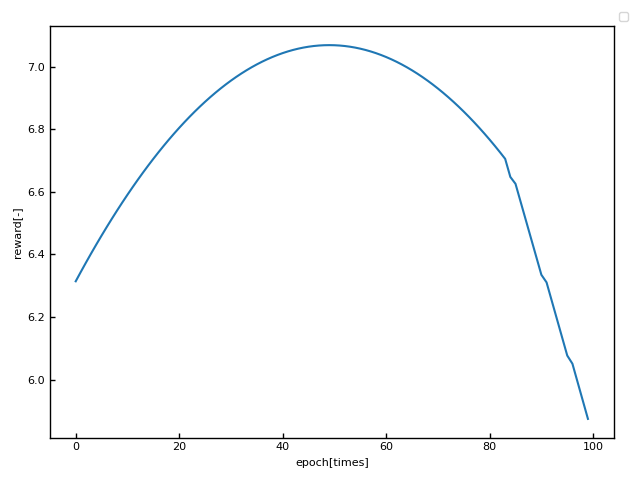

等周問題における深層強化学習の適用
---

### 等周問題

　周の長さが一定である図形の中で、面積が最大のものは円である（等周定理）。

### 深層強化学習

　本稿では、楕円モデルで形状を作成した。初期形状を横長楕円とし、横幅の増減を行動とする。それに対応する縦軸の長さをニュートン法で求めて、次の形状とする。形状を入力とし行動価値を出力するニューラルネットワークを設計する。目標値には強化学習で推定した行動価値を用いる。出力値と目標値の差分を誤差関数とする。最適化手法にはAdamを用いる。計算パラメータはhydraを用いてyamlファイルで管理してある。
```js
name: 'ellipse'
model:
  epsilon: 0.1
  batch_size: 50
  gamma: 0.9
  learning_rate: 0.00025
  synchro_time: 100
  weight_name: 'weight.pth'
  test_anim_name: 'test.GIF'
  warm_up_anim_name: 'warm_up.GIF'
  reward_fig_name: 'reward.png'
  test_reward_fig_name: 'reward.png'
  loss_fig_name: 'loss.png'
  anim_interval: 25
  train_anim_show: False

env: 
  init_wide: 2.0
  init_height: 1.0
  max_episode: 100
  max_epoch: 100
  warm_up_epoch: 100
  round_digit: 2
```
### トレーニング

　100epoch$\times$100episodeの10,000回学習をする。$\epsilon$-greedy法に従って、学習中は10%の確率で探索を行う。行動し、変更後の形状の面積を報酬として用いる。
```
python3 train.py
```
### テスト

　学習済みのネットワークで100回分の行動を検討する。グラフはテスト結果で最大報酬時の形状は円であることを示している。
```
python3 test.py
```
```
Input path of weight.pth-->
```

